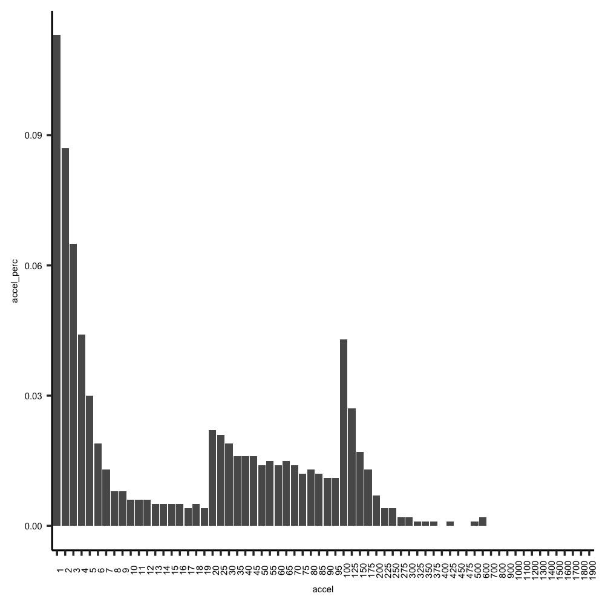
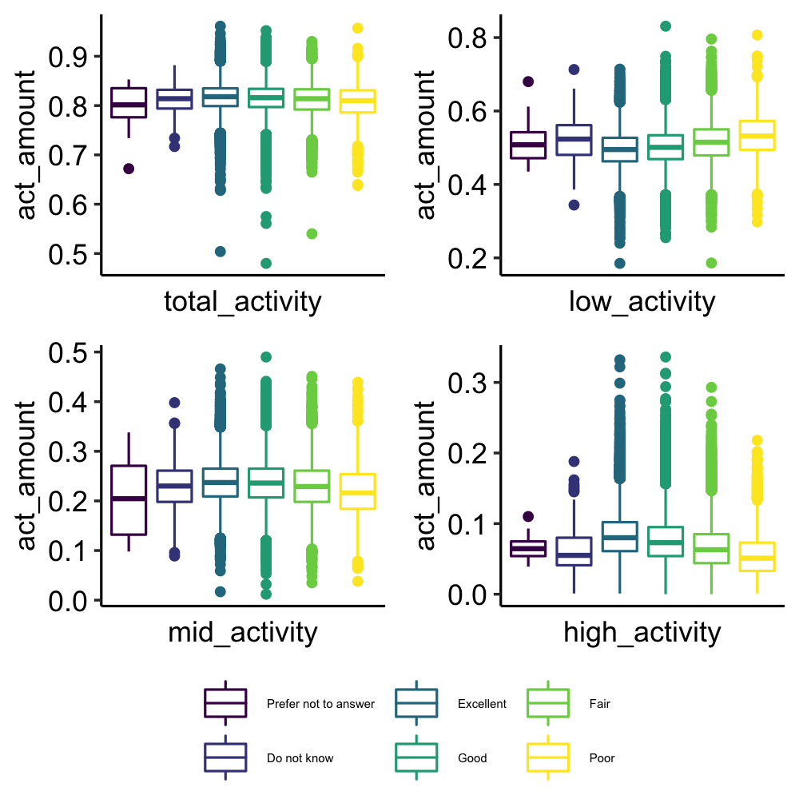
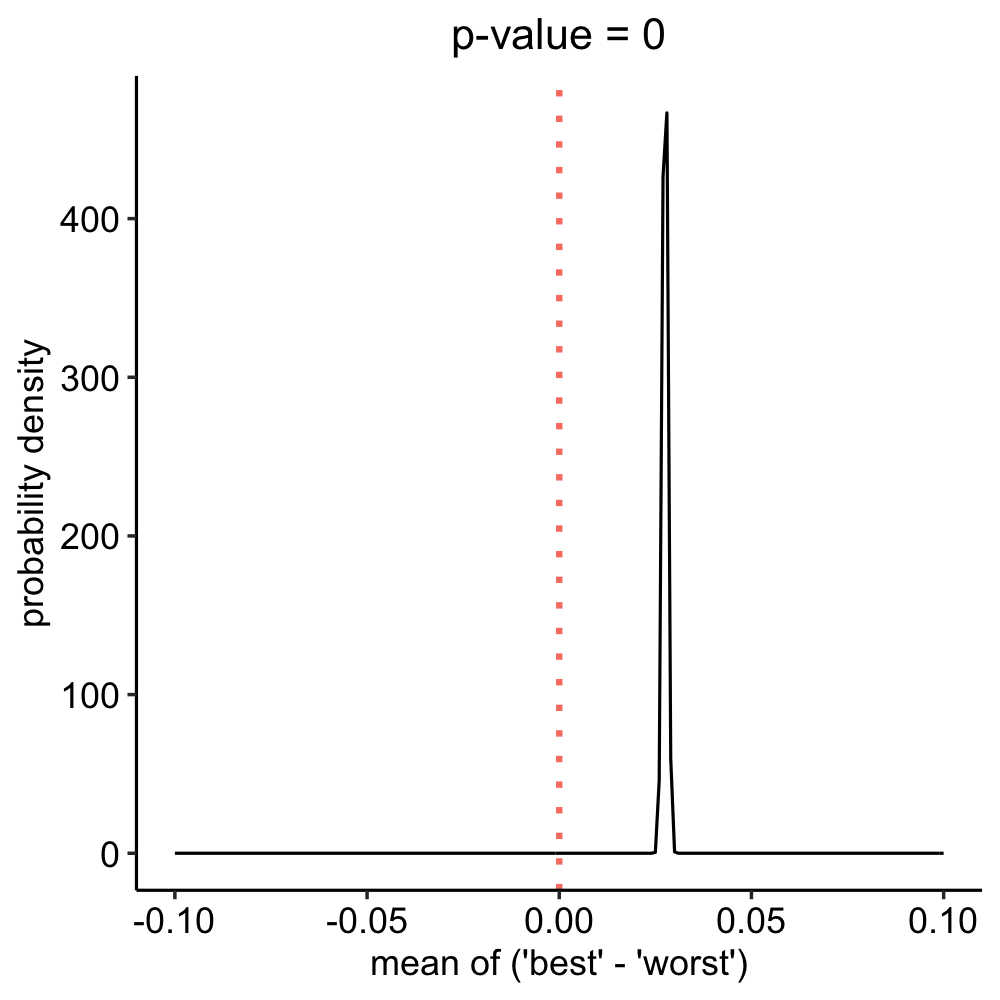

```{r, echo=FALSE}
library(knitr)
library(kableExtra)
library(pander)
```

```{r, echo=FALSE}
# Some recommended settings. 
opts_chunk$set(
  echo = FALSE,
  fig.pos = 'h',
  out.extra = "",   # To force the use of figure enviroment
  fig.cap = "Please caption every figure"
)
```

# Introduction

This template demonstrates some of the basic latex you'll need to know to create a ASA article.

\section{Background}
\label{sec:background}

```{r, echo=FALSE}
# [@willetts2018statistical], [@ravi2005activity], [@yang2010review]: wild, general, method, activity recognition
# [@guo2019accelerometer], [@guo2020physical], [@ramakrishnan2021accelerometer], [@barker2019physical], #[@cassidy2018accelerometer], [@dennison2021association]: ukbiobank, wild, statistical method, a specific disease
# [@nikbakhtian2021accelerometer]: ukbiobank, wild, statistical method, relate accelerometer sleep with a specific disease
# [@casale2011human]: controlled, general, machine learning method, activity recognition
# [@kubota2016machine]: disease, machine learning, opportunities
# [@alvarez2006comparison], [@nho2020cluster]: mechanical modeling, controlled
```

Physical activity is associated with human health conditions in many aspects. [@doherty2017large] Previous studies based on self-reported frequency and duration of participation in activity were not inefficient to draw the relationship between physical activity and clinical trails and health recommendations, as it is difficult to quantify total physical activity across multiple levels of intensity. To bridge the gap, the development of objective methods for measuring physical activity worked as a complement to the self-reported assessment. Accelerometry using wearable devices has been a widely accepted method for objective measurement of physical activity. Accelerometers are sensors which measure the acceleration of objects in motion along reference axes. The application of accelerometer with wearable devices can be roughly divided into 2 main categories: controlled and uncontrolled experiments. Controlled experiment require users perform certain actions including walking, sitting, falling etc. [@nho2020cluster, @casale2011human] Uncontrolled ones are usually carried out with wrist-worn devices. Users wearing them will act normally in daily life. The obtained accelerometry data can be analyzed with different purposes. One is mechanical modelling which estimates some certain features of the motion of human beings. An example was estimating step length from wearable accelerometer devices. [@alvarez2006comparison]. Another usage is for activity recognition and detection. Physical activity information can be extracted from accelerometry with certain signal processing techniques. Such information can be primarily be used for activity characterization. [@willetts2018statistical, @ravi2005activity, @yang2010review] Activity information can also be related to health outcomes. Previous studies validated the relationships between accelerometry-derived activity or sleep and some specific disease: obesity, cardiovascular disease, cardio-metabolic disease, breast cancer, psychiatric disorder and Parkinson's disease.[@guo2019accelerometer, @guo2020physical, @ramakrishnan2021accelerometer, @barker2019physical, @cassidy2018accelerometer, @dennison2021association, @nikbakhtian2021accelerometer] However, in this paper we will create bio-markers for general health conditions. Machine learning methods has been very efficient for detection of diseases. [@kubota2016machine] In this paper, we will combine statistical analysis and machine learning models to relate accelerometry-derived activity with health conditions.

\section{Data}
\label{sec:data}
## Dataset Type
In this paper, three different types of datasets were involved: Summary Data, Raw Accelerometry and ECG Data.   

Summary Data consisted of both users' demographic information and actigraphy. The actigraphy was obtained by summarizing Raw Accelerometry for each individual user. Raw Accelerometry recorded the signals from wearable device sensors to track human movement. (ECG data)

## Compliance
Compliance measures whether a user was in accordance with established guidelines for using the wearable devices. Data from users with compliance are more reliable to support further analysis. 

In Summary Data, there were three categorical variables (*data_quality_good_wear_time*, *data_quality_good_calibration*, and *data_quality_calibrated_on_own_data*) already provided by UK Biobank to determine data quality. In addition, actigraphy data were necessary for the analysis on relationship between activity and health conditions. So a user was considered to be compliant if 2 conditions were met:

1. Data quality variables equal to *Yes*;
2. Actigraphy data were present.

## Summary Data Analysis
### 3-peak Distribution of Accelerometry
In Summary Data, there were 67 fields recorded the fractions of acceleration less than or equal to 1, 2, ..., 2000 milli-gravities respectively for each user. Subtracting each fraction by its previous one generated the concrete fraction for each acceleration equal to 1, 2, ..., 1900 milli-gravities. Figure 1 showed a sample histogram of acceleration fractions. All the distributions of compliant users' accelerometry followed the same pattern as Figure 1. There were 3 peaks existing which divided the acceleration into 3 ranges: 1 - 19 milli-gravities, 20 - 95 milli-gravities and 100 - 1900 milli-gravities.  

```{r, echo=FALSE, out.height="35%", out.width="75%", fig.cap="Sample Accelerometry Distribution", fig.align='center'}

```

### Correlation Between Accelerometry and Activity
As the intensity of activity is positively correlated to acceleration, these 3 ranges of acceleration can be related to low, moderate and high intensity activities respectively. By summing up all the fractions in each range, the total fraction depicted the percentage of acceleration triggered by the different kinds of activities. For example, the total fraction of acceleration from 1 to 19 milli-gravities is proportional to the amount of low-intensity activity. In following analysis, sum of acceleration fractions would be taken as the value of certain activity amount directly. Table 1 shows the map between acceleration and activity groups.  

```{r, echo=FALSE}
tab1 = data.frame(acceleration = c("1 - 19 milli-gravities", "20 - 95 milli-gravities", 
                                   "100 - 1900 milli-gravities", "1 - 1900 milli-gravities"),
                  activity = c("low-intensity activity", "mid-intensity activity", 
                               "high-intensity activity", "total activity"))
kable(tab1, caption = "Map of Acceleration and Activity Group", format = "latex", 
      booktabs = "T", align = "c")
```

### Bivariate Analysis: Activity Amount vs. Medical Conditions
The Summary Data contained multiple variables indicating users' sleep, psychological and medical conditions. For example, *overall_health_rating* taking values of *Excellent*, *Good*, *Fair*, *Poor*, *Do not know* and *Prefer not to answer* indicated the overall health condition of a user. Figure 2 is the box plot of activity amount grouped by *overall_health_rating*.

```{r, echo=FALSE, out.height="45%", out.width="70%", fig.cap="Box Plot of Activity Amount Group by Overall Health Rating", fig.align='center'}

```

In the subplot of high-intensity activity, the distributions of activity amount for *Excellent*, *Good*, *Fair* and *Poor* users had significant differences. The health ratings were positively correlated to the amount of high-intensity activity. Similar patterns can also be found in other medical variables.

### Significance Validation
According to Central Limit Theorem, mean of activity amount for users with a certain medical condition approximates a normal distribution. Thus the differences between the mean of activity amount among users with multiple medical conditions should also approximate a normal distribution. Taking the minimal p-value for difference greater or less than 0 as the final statistics, we were able to validate whether activity amount can distinguish medical condition effectively.  
$$
p.value = min\{p.value(mean~~difference > 0),~~p.value(mean~~difference < 0)\}
$$

Figure 3 showed the approximated normal distribution density plot for the mean difference of high activity amount between users with *overall_health_rating* as *Excellent* and *Poor*. The final p-value was 0, which meant the high activity amount was significant to distinguish between users with "best" and "worst" health ratings.

```{r, echo=FALSE, out.height="45%", out.width="65%", fig.cap="Normal Distribution Approximation for Mean of High Activity Amount Difference Between Excellent and Poor", fig.align='center'}

```

Taking a series of medical variables and conducting the significance validation generated Table 2. It was obvious to see activity amount worked effectively to distinguish the differences for a considerable number of combinations in medical conditions. 

```{r, echo=FALSE}
tab2 = data.frame(read.csv("tab2.csv"))
kable(tab2, longtable = TRUE, caption = "Significance Validation of Activity Amount Differences Between Medical Conditions", format = "latex", booktabs = "T", align = "c") %>%
  column_spec(1, width = "2cm")
```
